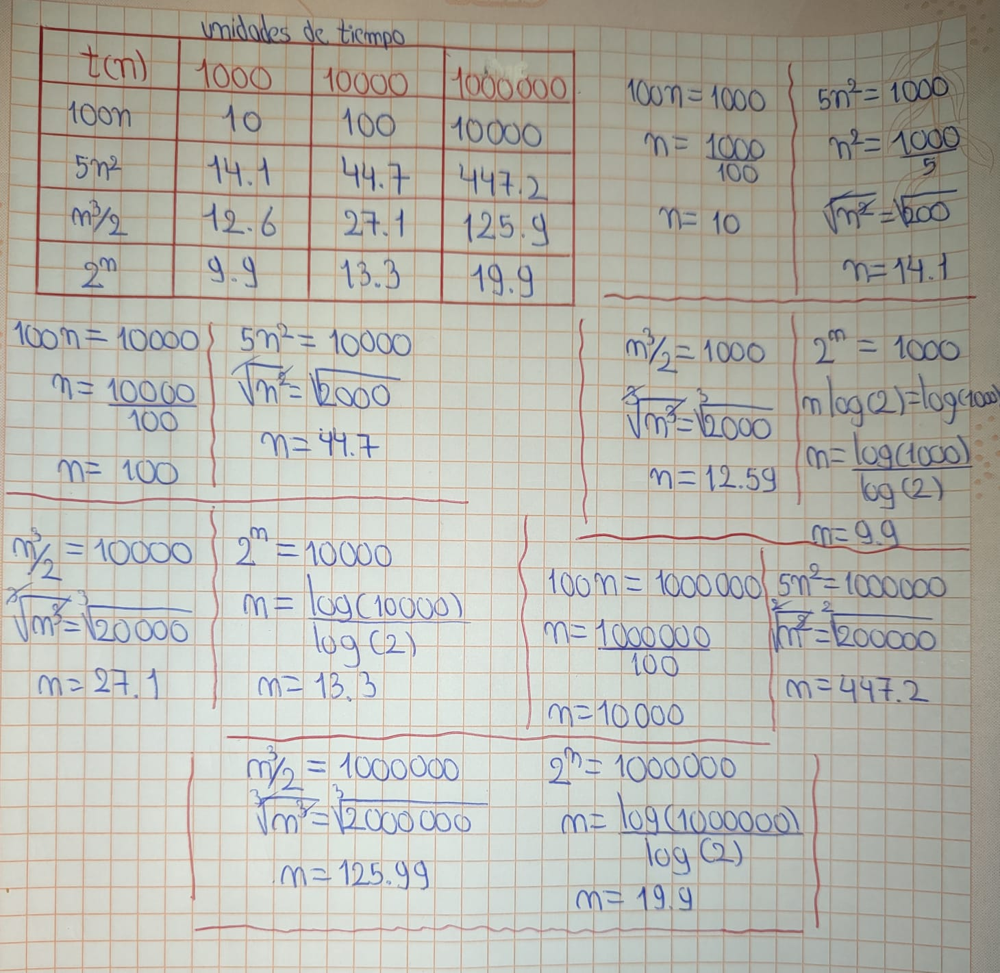

> **Autor:** *Ricardo Espinosa*
---
# Resumen de la Clase: Semana #1 - Bimestre #1

## ¿Qué son los algoritmos?
Un algoritmo es un conjunto de instrucciones o reglas bien definidas, organizadas en una secuencia, que sirven para resolver un problema o realizar una tarea específica. Los algoritmos pueden ser ejecutados manualmente o mediante una máquina, como una computadora, y deben ser claros, finitos y garantizados para producir un resultado en un número determinado de pasos.

> Un algoritmo es un conjunto de reglas para efectuar algun calculo bien sea a mano o mas frecuentemente en una maquina. *- Brassard y Bratley, 2012*

> ( E -> ALGORITMO ->  s=f(E) ) Se dice entonces que un algoritmo calcula una funcion f. La entrada es una variable independiente básica en la relacion a la que se producen las salidas del algoritmo, y tambien los analisis de tiempo y espacio *- (Valenzuela, 2003)*.

## ¿Qué es una instancia?
Una instancia se refiere a un conjunto específico de datos de entrada que se proporcionan a un algoritmo para ser procesados. Dependiendo de la instancia, el comportamiento y la eficiencia del algoritmo pueden variar, lo que puede influir en el tiempo de ejecución y el uso de recursos.

## ¿Qué es la algoritmia?
La algoritmia es la ciencia que estudia los algoritmos, su diseño, su análisis y su optimización. Implica comprender cómo se construyen los algoritmos para que resuelvan problemas de manera eficiente, considerando los recursos utilizados y el tiempo de ejecución.

## ¿Qué es el análisis de algoritmos?
El análisis de algoritmos es el proceso de evaluar la eficiencia de un algoritmo en términos de tiempo (complejidad temporal) y espacio (complejidad espacial). Este análisis permite entender cómo se comporta un algoritmo a medida que aumenta el tamaño de la entrada, ayudando a identificar las soluciones más óptimas en términos de recursos y rendimiento.

## Tipos de análisis de algoritmos
Existen dos tipos principales de análisis de algoritmos:

- **Análisis empírico**: Se basa en la ejecución del algoritmo con diversas entradas y se mide el tiempo real que tarda en procesar esos datos. Es útil para obtener una visión práctica de su rendimiento.
  
- **Análisis teórico**: Se enfoca en la estimación del tiempo de ejecución del algoritmo de manera formal, sin necesidad de ejecutar el código. Este análisis se basa en la teoría de la complejidad algorítmica y permite predecir cómo se comportará el algoritmo en función del tamaño de la entrada.

## Principio de Invarianza
*“Dos implementaciones distintas
de un mismo algoritmo no diferirán en su eficiencia en más
de alguna constante multiplicativa”.*

En otras palabras:

- Dos buenas implementaciones del mismo algoritmo siempre tendrán un rendimiento similar.

- Una puede ser un poquito más rápida que otra, pero no va a ser 10 veces más rápida.

- La diferencia es una constante pequeña, no un cambio brutal.

## Ejercicio de análisis de un algoritmo
Se realizó un ejercicio práctico en el que se analizó un algoritmo de manera teórica, observando como se comportaba si se aumentaba el tiempo de ejecución:

- **El peor caso**: El caso en el que el algoritmo toma más tiempo, tomando en cuenta todas las entradas posibles.
- **El caso promedio**: El tiempo de ejecución promedio tomando en cuenta todas las entradas posibles.
- **El mejor caso**: El caso en el que el algoritmo se ejecuta en el menor tiempo tomando en cuenta todas las entradas posibles.

Es importante destacar que siempre es mejor realizar el análisis del **peor caso**, ya que nos da una idea clara de los posibles cuellos de botella y por qué un algoritmo puede fallar o ser ineficiente en ciertas situaciones.