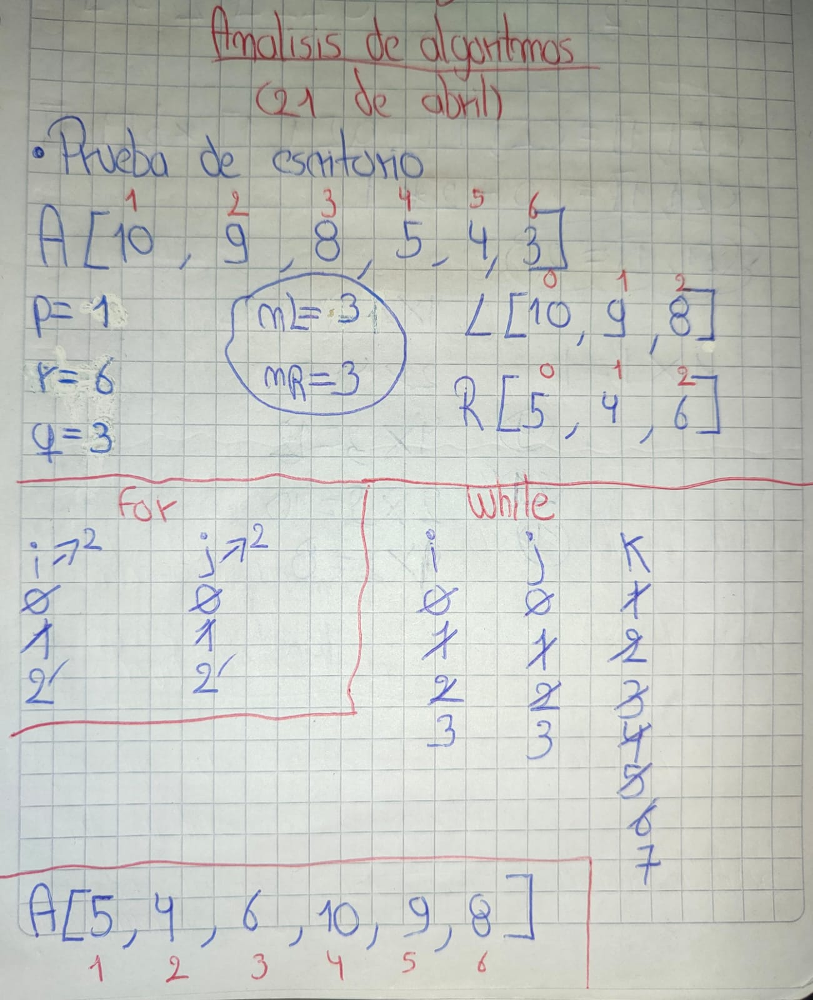
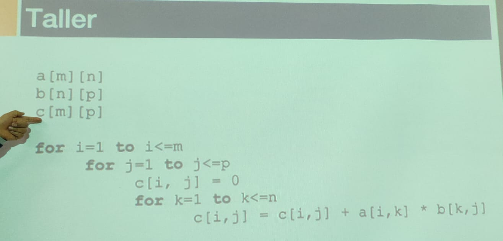
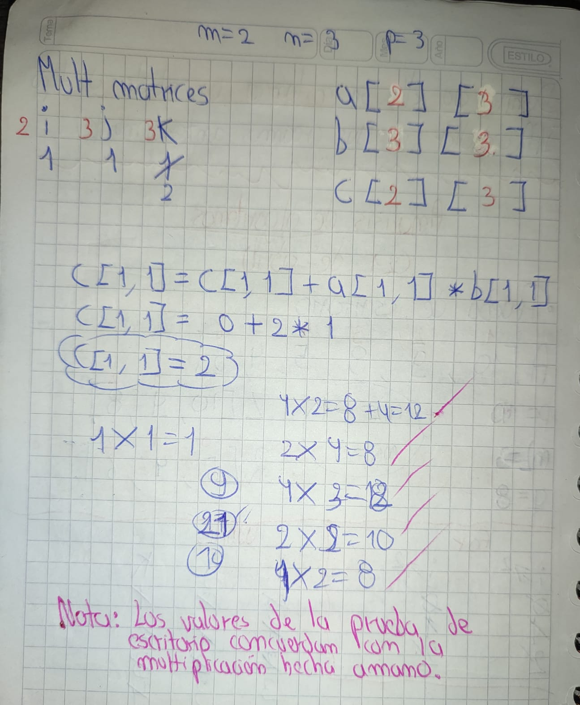

> **Autor:** *Ricardo Espinosa*
---
# Resumen de la Clase: Semana #3 - Bimestre #1

En esta clase hicimos la prueba de escritorio a dos algoritmos muy interesantes, el primero era un **metodo** parte del algoritmo  de ordenamiento **Merge Sort** y el otro tambien era un bucle que realizaba la multiplicación de dos matrices.

> A continuacion adjunto las imagenes de los ejercicios:

## Ejercicio #1

---
## PRUEBA DE ESCRITORIO

---

## Ejercicio #2

---
## PRUEBA DE ESCRITORIO
