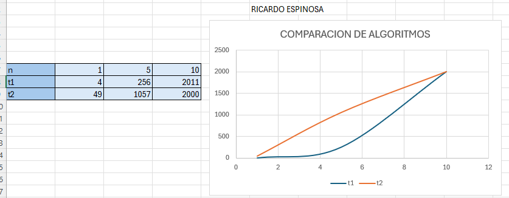

> **Autor:** *Ricardo Espinosa*
---
# Resumen de la Clase: Semana #4 - Bimestre #1

## Tema: Notación Asintótica (Big O)

En esta clase aprendimos sobre la notación asintótica, especialmente la **notación Big O**, que es una forma de describir cómo crece el tiempo de ejecución de un algoritmo a medida que aumenta el tamaño de la entrada.

La idea principal es que **no nos importa el tiempo exacto en segundos**, sino cómo se comporta el algoritmo en el peor de los casos, especialmente cuando los datos se hacen grandes. Por ejemplo, no es lo mismo un algoritmo que tarda como `n`, a uno que tarda como `n²` — el segundo se vuelve lento mucho más rápido.

Vimos varias funciones típicas que se usan en la notación Big O:

- `O(1)` → tiempo constante, no importa el tamaño de la entrada.
- `O(n)` → tiempo lineal, crece en proporción al tamaño.
- `O(n²)` → tiempo cuadrático, típico de algunos algoritmos de fuerza bruta.
- `O(log n)` → logarítmico, muy eficiente en entradas grandes (como búsqueda binaria).
- `O(n log n)` → común en algoritmos de ordenamiento como Merge Sort o Quick Sort.

También discutimos por qué es importante analizar algoritmos usando esta notación, ya que nos ayuda a compararlos sin necesidad de ejecutarlos con todos los casos posibles.

Además, **comparamos dos algoritmos diferentes** aplicados al mismo problema y **generamos una gráfica** con sus datos de tiempo de ejecución. Esto nos ayudó a visualizar claramente cuál era más eficiente y cómo se comportaban ambos al aumentar el tamaño de entrada.

## Comparacion:

---

### Examen Parcial

Durante esta clase también se realizó el **examen parcial** correspondiente al **primer bimestre**.