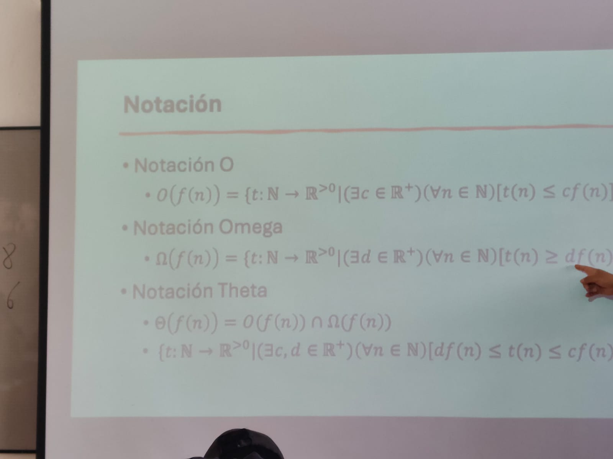

> **Autor:** *Ricardo Espinosa*
---
# Resumen de la Clase: Semana #5 - Bimestre #1

## Tema: Comparación entre Notaciones Asintóticas (O, Ω y Θ)

En esta clase nos enfocamos en entender las **tres notaciones asintóticas principales**: **O (Big O)**, **Ω (Omega)** y **Θ (Theta)**. Cada una representa un tipo distinto de análisis sobre el tiempo de ejecución de un algoritmo.

- **Notación O (Big O)**: Nos dice **el límite superior** del tiempo de ejecución. Es decir, en el peor de los casos, el algoritmo se comporta como mucho como `f(n)`.
  - Ejemplo: `O(n²)` significa que el tiempo de ejecución nunca va a superar algo proporcional a `n²`.

- **Notación Ω (Omega)**: Representa **el límite inferior**, o sea, el mejor de los casos. El algoritmo **como mínimo** se comporta como `f(n)` cuando todo sale bien.

- **Notación Θ (Theta)**: Describe el **crecimiento exacto** cuando tanto el mejor como el peor de los casos son del mismo orden. Es decir, el algoritmo siempre crece como `f(n)`.

También vimos una parte más formal de estas definiciones con expresiones matemáticas, donde aparecen constantes `c` y `d` para definir los límites.

> 

---

## Ejercicio final

Al final de la clase, realizamos un taller práctico con funciones concretas.

> Dado:  
> - `f(n) = n³ + 9n² log(n)`  
> - `g(n) = n² log(n)`  
>
> Se debe:
> - Comprobar si `f(n) ∈ O(g(n))`
> - Comprobar si `f(n) ∉ O(n²)`

Y adicionalmente:

> - Demostrar formalmente si existe relación de pertenencia entre:
>   - `f(n)` y `O(g(n))`
>   - `g(n)` y `O(f(n))`,  
>
> considerando las funciones:  
> - `f(n) = 2ⁿ`  
> - `g(n) = 2^(2n)`

El ejercicio quedo como tarea, y se encuentra en la carpeta: [tarea 2](../tareas/tarea_2/relaciones_crecimiento_asintotico.md)