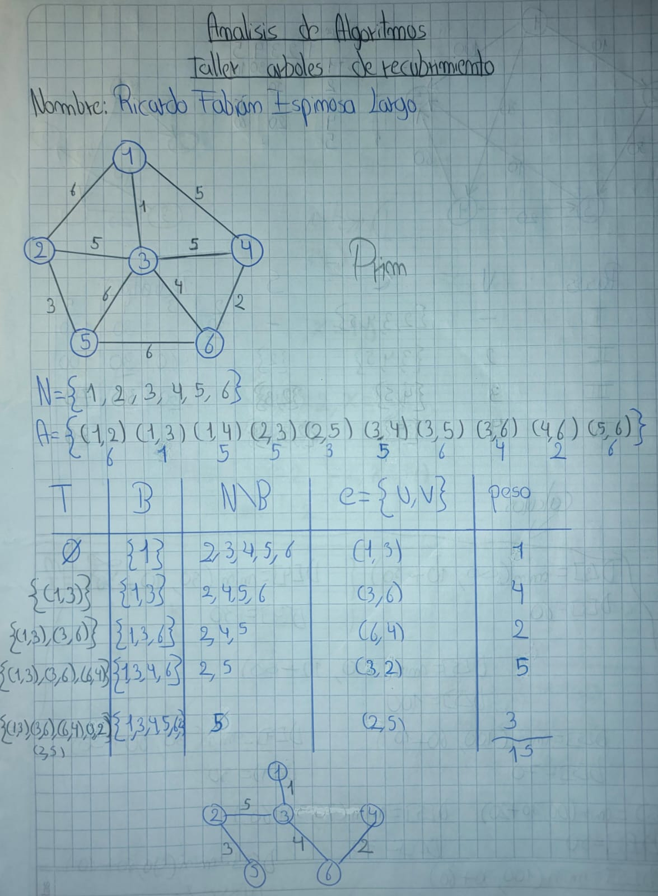
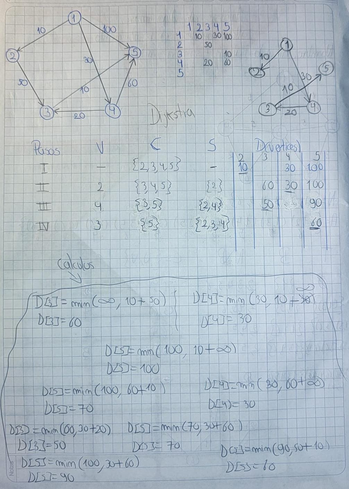

> **Autor:** *Ricardo Espinosa*
---
# Resumen de la Clase: Semana #10 - Bimestre #2

## Introducción

En esta semana nos enfocamos en dos algoritmos fundamentales para grafos ponderados: **Prim** y **Dijkstra**. Ambos se utilizan para encontrar caminos óptimos en un grafo, aunque cada uno tiene un objetivo diferente.

---

## Algoritmo de Prim (Árbol de recubrimiento mínimo)

El algoritmo de **Prim** permite encontrar un árbol de recubrimiento mínimo en un grafo no dirigido y ponderado. Su estrategia consiste en empezar desde cualquier nodo y, paso a paso, ir agregando al árbol el nodo más cercano que aún no está conectado, siempre eligiendo la arista de menor peso disponible.

### Pasos básicos del algoritmo de Prim

1. Elige un nodo inicial y márcalo como visitado.
2. Busca, entre todas las aristas que salen de los nodos visitados, la de menor peso que conecta con un nodo no visitado.
3. Agrega ese nodo y la arista al árbol.
4. Repite los pasos 2 y 3 hasta conectar todos los nodos.

### Pseudocódigo

```plaintext
Entrada: Grafo con nodos y aristas ponderadas
Inicializar conjunto de nodos visitados con un nodo inicial
Inicializar árbol MST vacío

Mientras haya nodos sin visitar:
    Buscar la arista más barata que conecta un nodo visitado con uno no visitado
    Agregar esa arista y el nodo al MST
    Marcar el nodo como visitado
```

---

## Algoritmo de Dijkstra (Caminos más cortos)

El algoritmo de **Dijkstra** se utiliza para encontrar el camino más corto desde un nodo origen a todos los demás nodos en un grafo ponderado con pesos no negativos. Es ideal para problemas de rutas, como el cálculo de trayectorias óptimas en mapas o redes.

### Pasos básicos del algoritmo de Dijkstra

1. Asigna a cada nodo una distancia inicial infinita, excepto al nodo origen, que tiene distancia 0.
2. Marca todos los nodos como no visitados. Define el nodo actual como el origen.
3. Para el nodo actual, examina todos sus vecinos no visitados y calcula sus distancias temporales desde el origen. Si la nueva distancia es menor que la registrada, actualiza la distancia.
4. Una vez revisados todos los vecinos, marca el nodo actual como visitado.
5. Si todos los nodos han sido visitados, termina. Si no, selecciona el nodo no visitado con la distancia más baja y repite desde el paso 3.

### Pseudocódigo

```plaintext
Entrada: Grafo, nodo_origen
Para cada nodo:
    distancia[nodo] = infinito
    predecesor[nodo] = nulo

distancia[nodo_origen] = 0
conjunto_no_visitados = todos los nodos

Mientras conjunto_no_visitados no esté vacío:
    nodo_actual = nodo no visitado con menor distancia
    Para cada vecino del nodo_actual:
        si vecino no está visitado:
            distancia_temporal = distancia[nodo_actual] + peso_arista(nodo_actual, vecino)
            Si distancia_temporal < distancia[vecino]:
                distancia[vecino] = distancia_temporal
                predecesor[vecino] = nodo_actual
    Marcar nodo_actual como visitado (eliminarlo del conjunto_no_visitados)
```

---

## Ejercicios prácticos

Al final de la clase realizamos dos ejercicios para afianzar los conceptos:

* **Ejercicio 1:** Resolución de un árbol de recubrimiento mínimo usando el algoritmo de Prim.



* **Ejercicio 2:** Búsqueda de caminos más cortos usando el algoritmo de Dijkstra.



---

