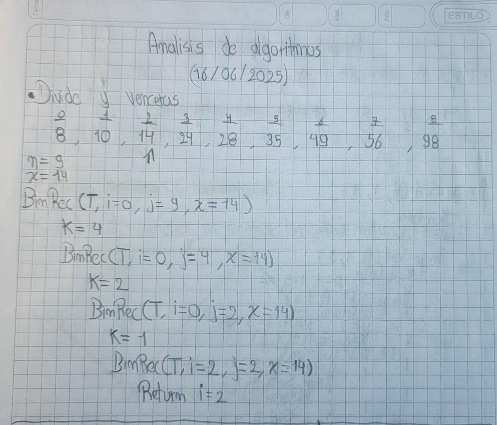

> **Autor:** *Ricardo Espinosa*
---
# Resumen de la Clase: Semana #11 - Bimestre #2

# Algoritmos Divide y Vencerás y Búsqueda Binaria

## Introducción al Paradigma Divide y Vencerás

El paradigma **Divide y Vencerás** es una estrategia de diseño de algoritmos que consiste en dividir un problema grande en subproblemas más pequeños y sencillos, resolver cada uno de ellos de manera independiente y luego combinar sus soluciones para obtener el resultado final. Es un enfoque muy utilizado porque, además de ser intuitivo, suele mejorar la eficiencia en muchos casos.

### Características principales

* Separa el problema original en partes más pequeñas (dividir).
* Resuelve recursivamente cada subproblema (vencer).
* Combina las soluciones parciales para obtener la solución global (unir).

Este enfoque es la base de muchos algoritmos clásicos, como la ordenación por fusión (Merge Sort), la multiplicación rápida de matrices y la búsqueda binaria.

---

## Búsqueda Binaria

La **búsqueda binaria** es un algoritmo eficiente para encontrar un elemento en una lista ordenada. Su funcionamiento se basa en comparar el elemento buscado con el del centro del intervalo de búsqueda:

* Si son iguales, se ha encontrado el elemento.
* Si el buscado es menor, se repite la búsqueda en la mitad izquierda.
* Si es mayor, en la mitad derecha.

Este proceso se repite hasta encontrar el elemento o reducir el intervalo a cero. La búsqueda binaria es mucho más eficiente que una búsqueda lineal, ya que descarta la mitad de los elementos en cada paso.

### Pseudocódigo de búsqueda binaria recursiva (binrec)

```plaintext
Funcion busqueda_binaria(lista, inicio, fin, objetivo):
    Si inicio > fin:
        Retornar -1 // No se encontró el elemento
    medio = (inicio + fin) // 2
    Si lista[medio] == objetivo:
        Retornar medio // Encontrado
    Si objetivo < lista[medio]:
        Retornar busqueda_binaria(lista, inicio, medio - 1, objetivo)
    Si objetivo > lista[medio]:
        Retornar busqueda_binaria(lista, medio + 1, fin, objetivo)
```

---

## Ejercicio práctico

Al final de la clase se resolvió un ejercicio aplicando la búsqueda binaria recursiva (binrec) para afianzar el concepto.


---
