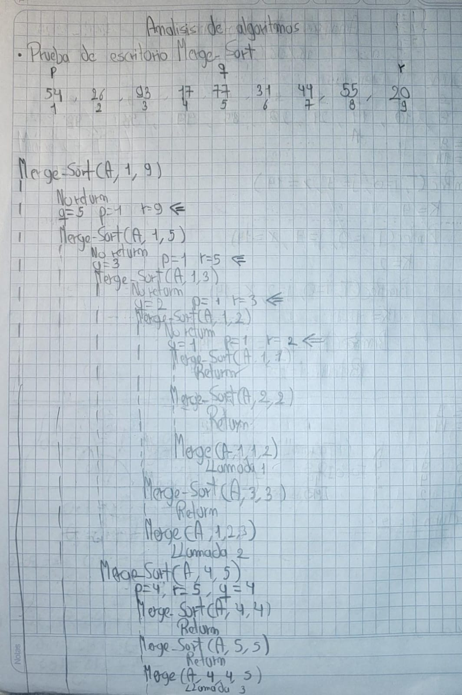

> **Autor:** *Ricardo Espinosa*
---
# Resumen de la Clase: Semana #12 - Bimestre #2

# Divide y Vencerás como Recursividad

## Introducción al Paradigma Divide y Vencerás Recursivo

Esta semana profundizamos en el paradigma **Divide y Vencerás**, entendido como una poderosa forma de recursividad. Aquí, un problema grande se resuelve dividiéndolo en subproblemas más pequeños y similares, solucionando cada uno recursivamente y, al final, combinando esas soluciones para llegar a la respuesta del problema original.

### Características clave

* Se basa en la recursividad: la función principal se llama a sí misma con entradas más pequeñas.
* Tiene uno o varios **casos base** que detienen la recursividad.
* Después de resolver los subproblemas, combina los resultados para construir la solución global.

Este enfoque es esencial en muchos algoritmos famosos como Merge Sort, Quick Sort, la búsqueda binaria y la multiplicación rápida de matrices.

---

## Ejemplo general: Merge Sort recursivo

Uno de los ejemplos más clásicos de divide y vencerás recursivo es el **Merge Sort**:

```plaintext
Funcion merge_sort(lista):
    Si longitud(lista) <= 1:
        Retornar lista
    mitad = longitud(lista) // 2
    izquierda = merge_sort(lista[0 : mitad])
    derecha = merge_sort(lista[mitad : ])
    Retornar fusionar(izquierda, derecha)
```

**Explicación breve:**

* Divide la lista en dos partes.
* Ordena cada parte de forma recursiva.
* Fusiona ambas partes ya ordenadas en una sola lista.

---

## Prueba de escritorio de Merge Sort

Como parte de la clase, se realizó la prueba de escritorio del algoritmo **Merge Sort** para visualizar paso a paso cómo funciona la recursividad en divide y vencerás.

**Pasos generales del Merge Sort:**

1. Si la lista tiene uno o cero elementos, ya está ordenada (caso base).
2. Si tiene más elementos, se divide en dos mitades.
3. Se aplica recursividad para ordenar cada mitad.
4. Se fusionan ambas mitades ordenadas en una sola lista.

---

## Actividad práctica

En clase se hizo una **prueba de escritorio** del Merge Sort, resolviendo un ejercicio paso a paso. Aquí puedes añadir la imagen de la solución desarrollada:



---
