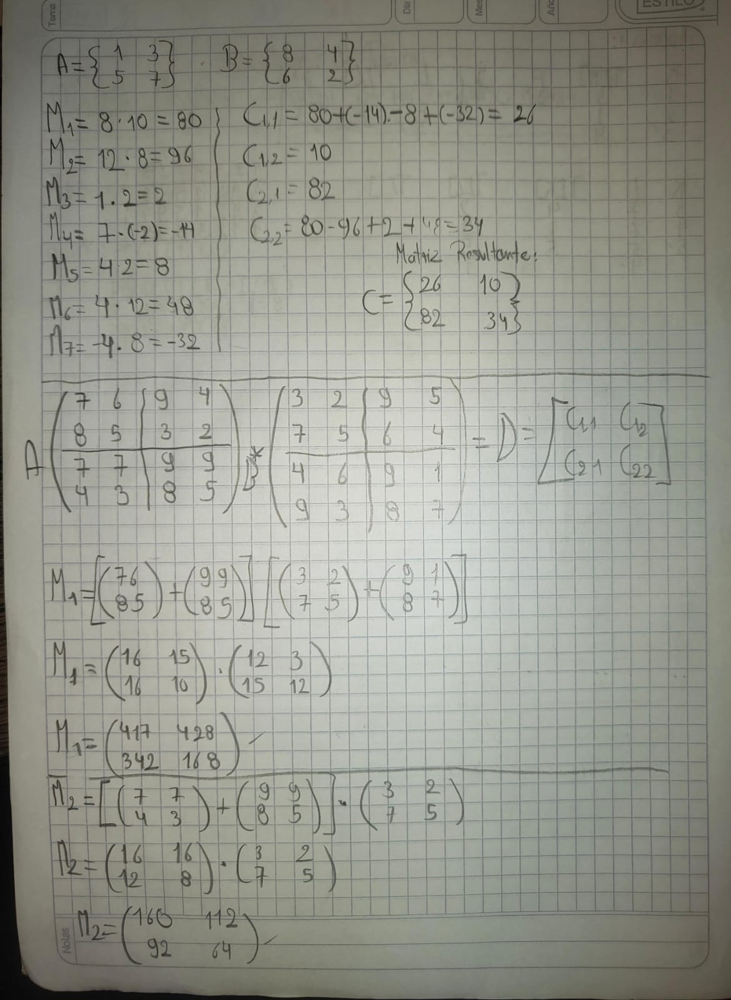
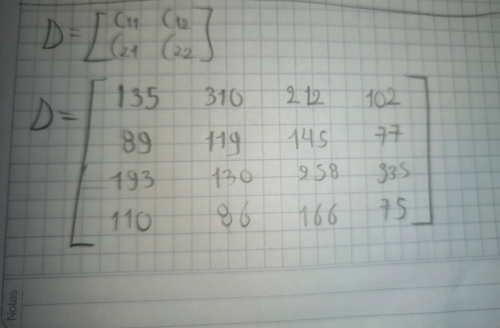

> **Autor:** *Ricardo Espinosa*
---
# Resumen de la Clase: Semana #13 - Bimestre #2

# Mediana y Multiplicación de Matrices (Strassen)

## Cálculo de la Mediana

Esta semana se abordó el problema del cálculo de la **mediana** de un conjunto de números, aplicando estrategias de *divide y vencerás* para mejorar la eficiencia frente a métodos tradicionales. La mediana es el valor que se encuentra justo en el centro de una lista ordenada de datos. Su cálculo es fundamental en análisis de datos y algoritmos, especialmente cuando se busca encontrar valores representativos en grandes conjuntos.

**¿Cómo se calcula la mediana de manera eficiente?**

* Se puede ordenar el conjunto de datos y tomar el elemento del medio (o el promedio de los dos del centro si hay un número par de datos).
* Con técnicas de divide y vencerás, como la selección por rangos o el algoritmo de búsqueda de orden estadístico, se puede encontrar la mediana sin ordenar toda la lista, optimizando recursos.

---

## Algoritmo de Multiplicación de Matrices (Strassen)

También vimos el **algoritmo de Strassen** para la multiplicación de matrices, una mejora sobre el método clásico. El algoritmo de Strassen utiliza el enfoque de divide y vencerás para descomponer las matrices en submatrices más pequeñas, logrando realizar menos multiplicaciones y así reducir la complejidad del proceso.

**¿Por qué es importante?**

* Permite multiplicar matrices grandes de forma más eficiente que el método convencional.
* Reduce el número de operaciones, haciendo el cálculo más rápido especialmente para matrices de gran tamaño.

**Pasos generales del algoritmo de Strassen:**

1. Se divide cada matriz en cuatro submatrices.
2. Se calculan siete productos principales entre las submatrices, en lugar de ocho como en el método tradicional.
3. Se combinan estos resultados para obtener la matriz producto final.

### Pseudocódigo simplificado:

```plaintext
Función Strassen(A, B):
    Si A y B son matrices 1x1:
        Retornar el producto de A y B
    Dividir A y B en submatrices A11, A12, A21, A22 y B11, B12, B21, B22
    Calcular los 7 productos principales (M1 a M7)
    Combinar los resultados para formar la matriz resultado C
    Retornar C
```

---

## Actividad y ejercicio práctico

En clase se realizó una actividad práctica y se resolvió un ejercicio aplicando el algoritmo de Strassen para la multiplicación de matrices. A continuación puedes añadir la imagen de la solución desarrollada en clase:




---