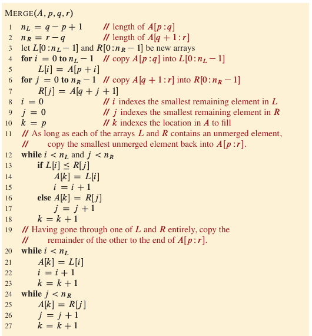
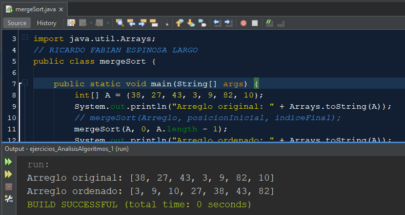

> AUTOR: Ricardo Espinosa
# Implementación de Merge Sort en Java

## Introducción

En esta tarea se presenta la **implementación en Java** del algoritmo de ordenamiento **Merge Sort**. Merge Sort es un algoritmo de división y conquista que divide recursivamente el arreglo en mitades, las ordena y luego las combina (merge) para formar un arreglo ordenado.

Ademas de esta documentación, adjunto el enlace del archivo java: [archivo java](../../tareas/tarea_1/mergeSort.java)


## Pseudocodigo

---
# Implementación:

## Sección 1: Clase Principal y Método Main

```java
public class mergeSort {
    public static void main(String[] args) {
        int[] arreglo = {12, 11, 13, 5, 6, 7};

        System.out.println("Arreglo original:");
        imprimirArreglo(arreglo);

        sort(arreglo, 0, arreglo.length - 1);

        System.out.println("\nArreglo ordenado:");
        imprimirArreglo(arreglo);
    }
```

**Explicación:**
Esta es la clase principal `mergeSort` que contiene el método `main`. Dentro de `main`, se declara un arreglo de enteros, se imprime su contenido original, se llama al método `sort` para ordenarlo y finalmente se imprime el arreglo ya ordenado.

---

## Sección 2: Método de Ordenamiento Recursivo (sort)

```java
    public static void sort(int[] arr, int izquierda, int derecha) {
        if (izquierda < derecha) {
            int medio = izquierda + (derecha - izquierda) / 2;

            sort(arr, izquierda, medio);
            sort(arr, medio + 1, derecha);

            merge(arr, izquierda, medio, derecha);
        }
    }
```

**Explicación:**
Este método implementa la lógica recursiva de Merge Sort. Divide el arreglo en dos mitades hasta que ya no se pueda dividir más (caso base). Luego, fusiona las mitades ordenadas con el método `merge`.

---

## Sección 3: Método de Mezcla (merge)

```java
    public static void merge(int[] arr, int izquierda, int medio, int derecha) {
        int n1 = medio - izquierda + 1;
        int n2 = derecha - medio;

        int[] L = new int[n1];
        int[] R = new int[n2];

        for (int i = 0; i < n1; ++i)
            L[i] = arr[izquierda + i];
        for (int j = 0; j < n2; ++j)
            R[j] = arr[medio + 1 + j];

        int i = 0, j = 0;
        int k = izquierda;
        while (i < n1 && j < n2) {
            if (L[i] <= R[j]) {
                arr[k] = L[i];
                i++;
            } else {
                arr[k] = R[j];
                j++;
            }
            k++;
        }

        while (i < n1) {
            arr[k] = L[i];
            i++;
            k++;
        }

        while (j < n2) {
            arr[k] = R[j];
            j++;
            k++;
        }
    }
```

**Explicación:**
Este método se encarga de **fusionar dos subarreglos ordenados** (`L` y `R`) en una sola sección del arreglo original. Primero se copian los elementos a arreglos auxiliares, luego se comparan y se insertan de forma ordenada.

---

## Sección 4: Método para Imprimir el Arreglo

```java
    public static void imprimirArreglo(int[] arr) {
        int n = arr.length;
        for (int i = 0; i < n; ++i)
            System.out.print(arr[i] + " ");
        System.out.println();
    }
}
```

**Explicación:**
Este método simplemente imprime los elementos del arreglo separados por espacios. Se utiliza antes y después de la ordenación para mostrar el resultado al usuario.
---
### Imagen de ejecución del codigo:

---

## Conclusión

La implementación de Merge Sort en Java presentada aquí demuestra un enfoque clásico y eficiente para ordenar arreglos. Al estar dividido en métodos bien definidos, el código es claro, modular y fácil de mantener. Este algoritmo garantiza una complejidad logarítmica incluso en los peores casos, lo que lo hace una excelente opción para tareas de ordenamiento exigentes.