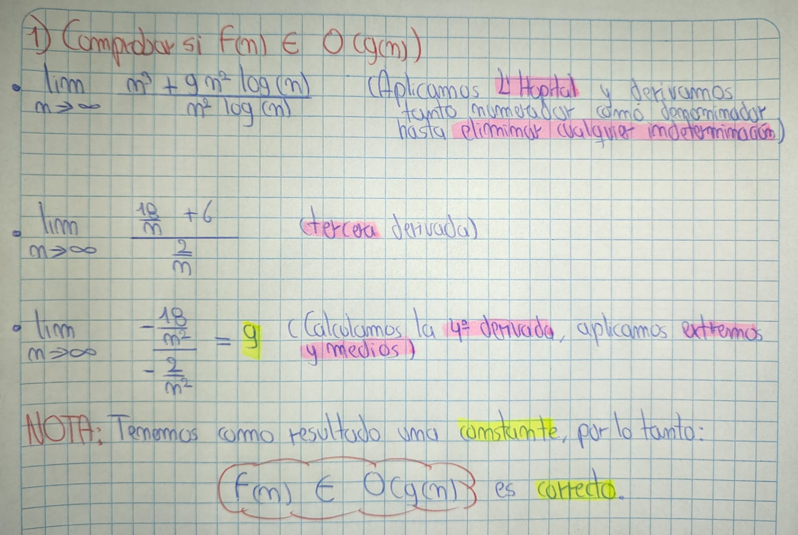
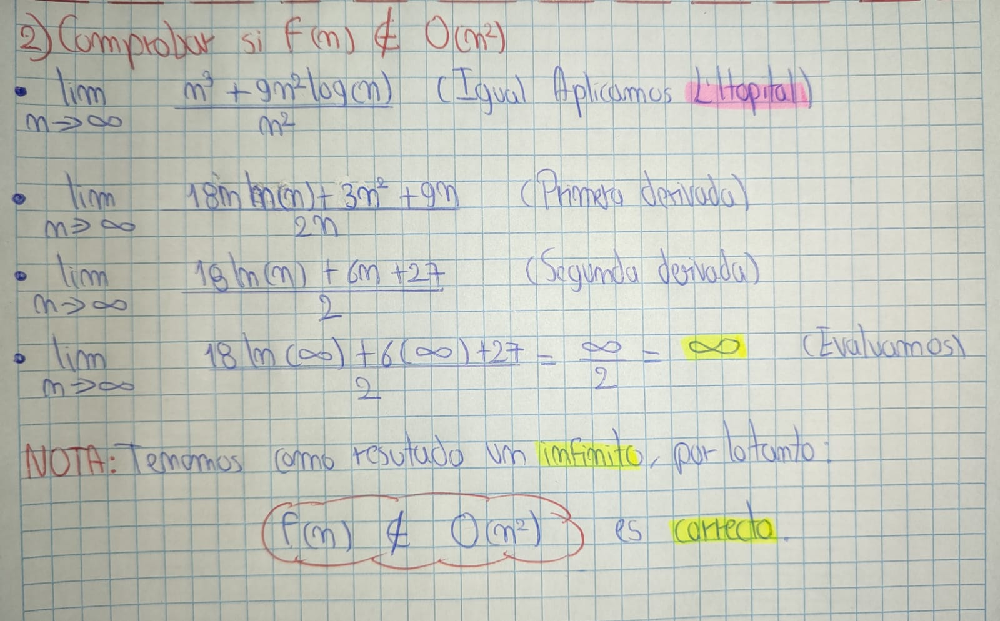
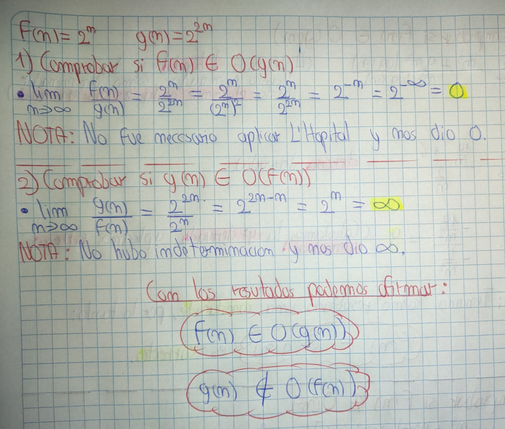

# Tarea: Análisis de Notaciones Asintóticas

## Introducción

En esta tarea se analiza el comportamiento asintótico de funciones matemáticas usando notaciones como **O(grande)**. Este tipo de ejercicios es fundamental en el estudio del análisis de algoritmos, ya que permite clasificar funciones según su crecimiento y eficiencia computacional.

---

## Solucion

Dadas las funciones:

* $f(n) = n^3 + 9n^2 \log(n)$
* $g(n) = n^2 \log(n)$

Se pide:

* Comprobar si $f(n) \in O(g(n))$

* Comprobar si $f(n) \notin O(n^2)$

Ademas:
* Demostrar formalmente la relación de pertenencia entre:

  * $f(n) = 2^n$ y $g(n) = 2^{2n}$, es decir, si $f(n) \in O(g(n))$ y/o $g(n) \in O(f(n))$

  

## Conclusión

Este ejercicio refuerza la comprensión de las notaciones asintóticas, herramientas clave para comparar la eficiencia algorítmica en función del crecimiento de entrada. Las pruebas realizadas permiten determinar si una función crece más rápido, igual o más lento que otra.
