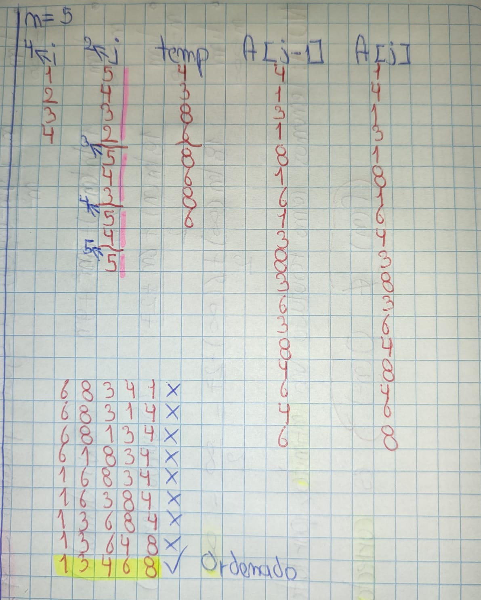
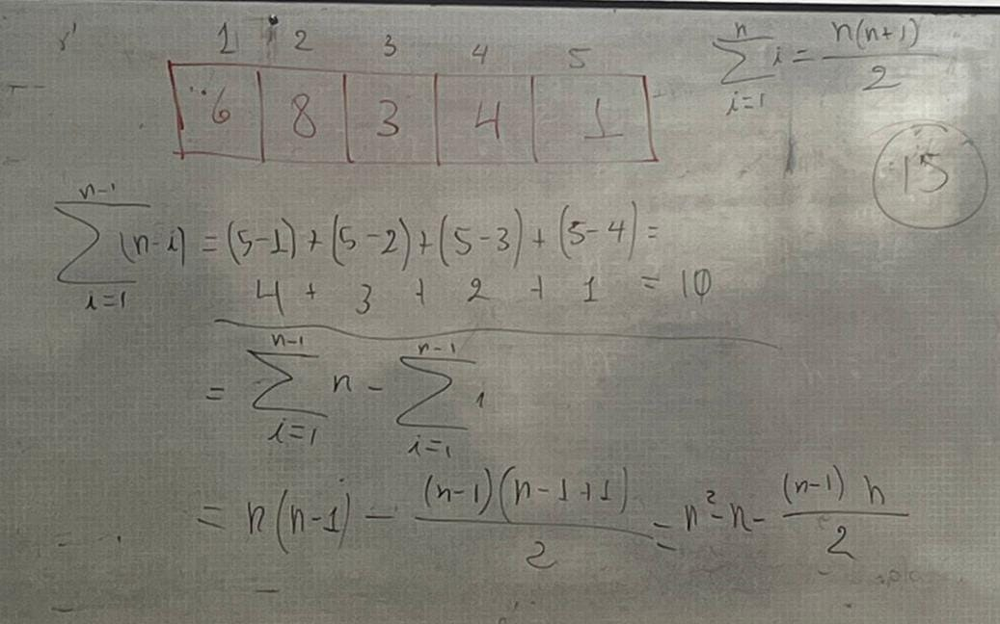
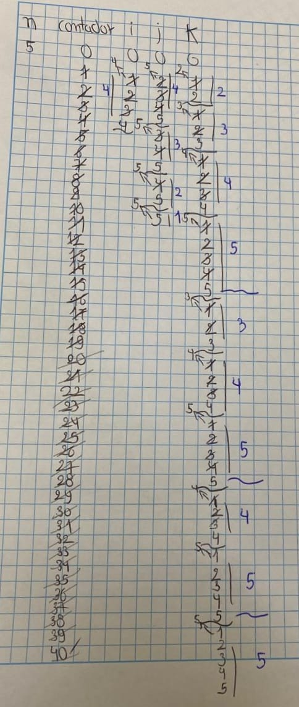

> AUTOR: Ricardo Fabian Espinosa Largo
# Tarea 3: Análisis de complejidad mediante sumatorias

## Introducción

En esta tarea se analizará la complejidad de dos algoritmos mediante el uso de **expresiones de sumatorias**. Se transformarán los bucles anidados de cada algoritmo en expresiones matemáticas que describan su número de operaciones, con el objetivo de determinar su complejidad asintótica.

---

## Ejercicio 1: Algoritmo de burbuja (Bubble Sort)

A continuación se presenta el código del algoritmo de ordenamiento burbuja que ordena un arreglo de menor a mayor:

```pascal
procedure burbuja ( var A: array [1..n] of integer );
// burbuja clasifica el arreglo A de menor a mayor
var
    i, j, temp: integer;
begin
    for i := 1 to n - 1 do
        for j := n downto i + 1 do
            if A[j - 1] > A[j] then begin
                // intercambia A[j - 1] y A[j]
                temp := A[j];
                A[j] := A[j - 1];
                A[j - 1] := temp;
            end;
end; // burbuja
```

## Prueba de escritorio

---

## Resultados obtenidos


## Ejercicio 2: Análisis del algoritmo "misterio"

A continuación se presenta un algoritmo cuyo objetivo es analizar el crecimiento de su función de tiempo \( T(n) \), en función de sus bucles anidados:

```pascal
procedure misterio(n: integer)
var
    contador, i, j, k: integer;
begin
    contador := 0;
    for i := 1 to n - 1 do
        for j := i + 1 to n do
            for k := 1 to j do
                contador := contador + 1;
end;
```
### Versión del algoritmo en java
```java
public class Misterio {

    public static void misterio(int n) {
        int contador = 0;
        for (int i = 1; i <= n - 1; i++) {
            for (int j = i + 1; j <= n; j++) {
                for (int k = 1; k <= j; k++) {
                    contador = contador + 1;
                }
            }
        }
    }

}
```
## Prueba de escritorio


## Resultados obtenidos

## Expresión de complejidad

El contador se incrementa en un bucle triple. Para calcular cuántas veces se ejecuta la instrucción final, usamos la siguiente expresión de sumatorias:

$$
T(n) = \sum_{i=1}^{n-1} \sum_{j=i+1}^{n} \sum_{k=1}^{j} 1
$$

La suma más interna equivale a $j$, entonces:

$$
T(n) = \sum_{i=1}^{n-1} \sum_{j=i+1}^{n} j
$$

## Conclusión

La expresión representa el total de incrementos del contador. El crecimiento de esta suma es del orden de:

$$
T(n) \in \mathcal{O}(n^3)
$$

lo cual implica que el algoritmo tiene complejidad cúbica en el peor caso.