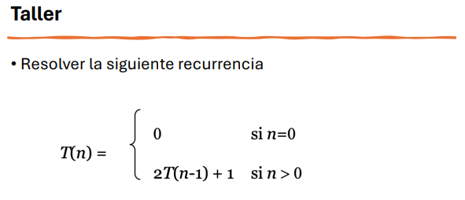
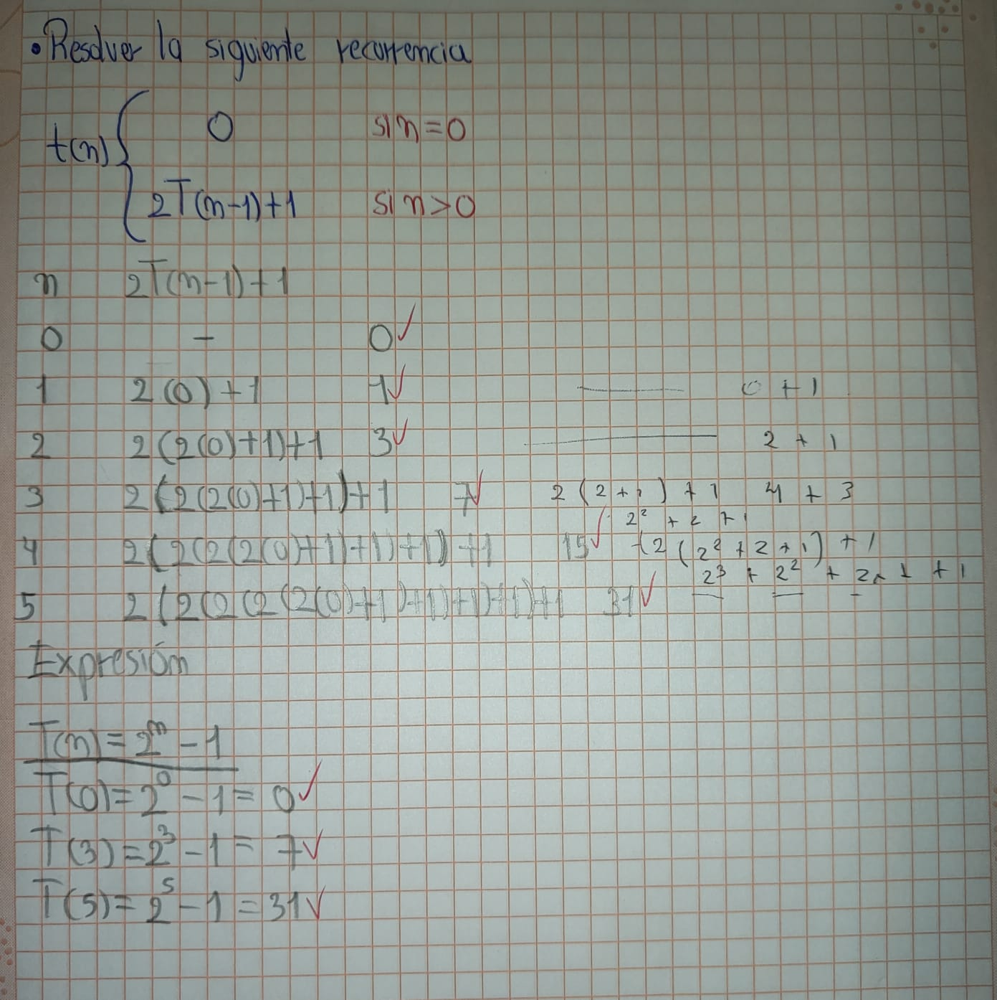
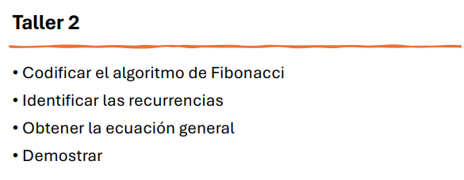
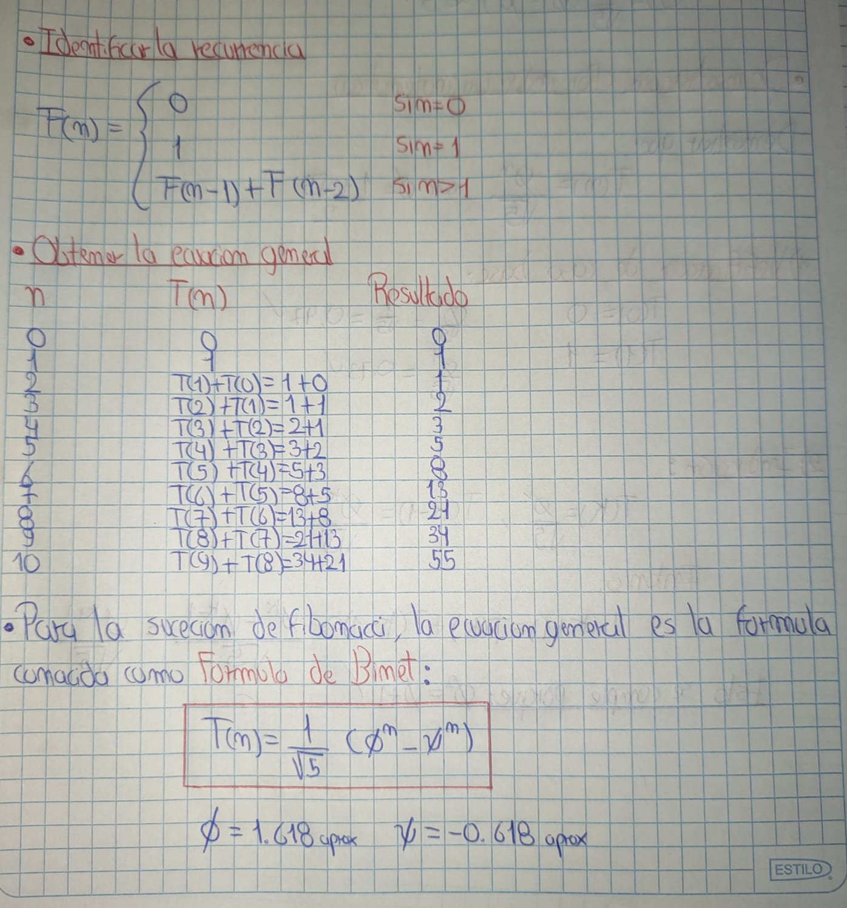
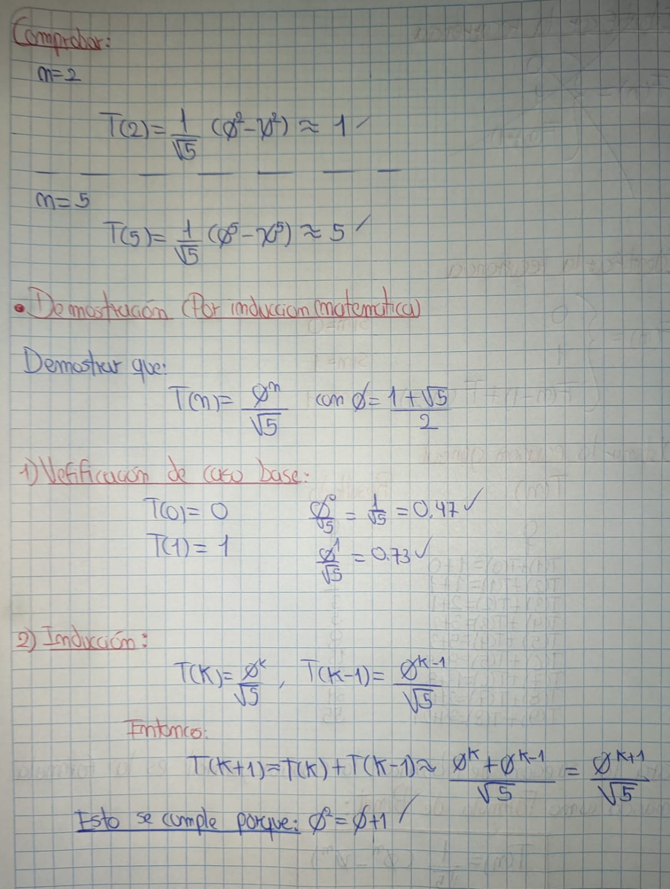

> AUTOR: Ricardo Fabian Espinosa Largo
# Tarea 4: Resolver recurrencias

### Ejercicio 1

### Solución


---
### Ejercicio 2

### Solución
## 1. Codificar el algoritmo de Fibonacci en Java

A continuación se presenta una versión recursiva del algoritmo de Fibonacci en Java:

```java
public class Fibonacci {

    public static int fibonacci(int n) {
        if (n == 0 || n == 1) {
            return n;
        } else {
            return fibonacci(n - 1) + fibonacci(n - 2);
        }
    }

    public static void main(String[] args) {
        int n = 10;
        for (int i = 0; i <= n; i++) {
            System.out.println("F(" + i + ") = " + fibonacci(i));
        }
    }
}
```
---

