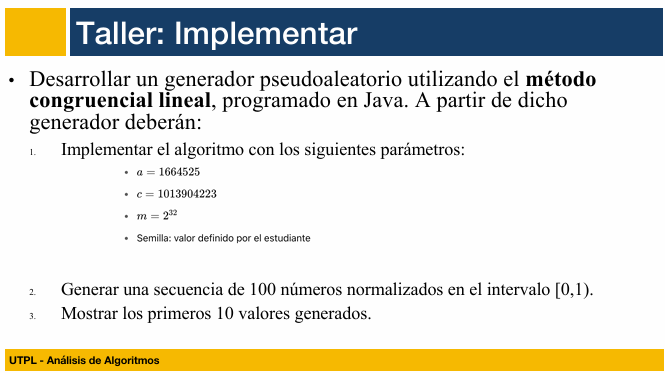
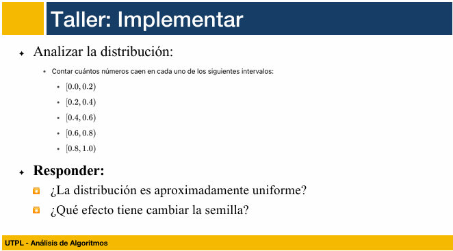
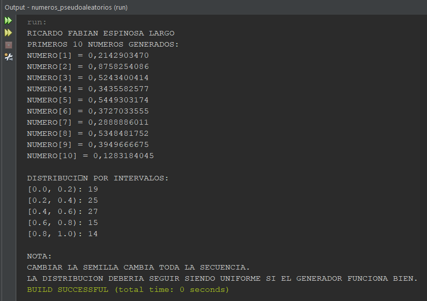

> AUTOR: Ricardo Espinosa
# Generación y Análisis de Números Pseudoaleatorios

## ARCHIVO JAVA
Ademas de esta documentación, adjunto el enlace del archivo java: [archivo java](../../tareas/tarea_5(2Bim)/Numeros_pseudoaleatorios.java)

## INTRODUCCION

En esta práctica se aborda el estudio de los algoritmos aleatorios y el análisis de su comportamiento mediante la generación de números pseudoaleatorios.

Un número pseudoaleatorio es un valor que simula ser aleatorio, pero en realidad es generado por un algoritmo determinista. A pesar de no ser verdaderamente aleatorios, si se diseñan correctamente, estos números pueden presentar una distribución estadística que imita los comportamientos de aleatoriedad reales, lo cual es útil en múltiples aplicaciones prácticas.

Uno de los métodos más conocidos para generar estos números es el **generador congruencial lineal**, el cual permite producir una secuencia de valores dentro del intervalo [0, 1), a partir de una semilla inicial y un conjunto de parámetros bien definidos.

Esta actividad se enfoca en implementar dicho generador en el lenguaje de programación Java, generar un conjunto de números, y analizar su distribución para determinar si el comportamiento estadístico se aproxima a una distribución uniforme.

## TALLER



## SOLUCION CODIGO
```java
class GeneradorCongruencialLineal {

    // DEFINIMOS LOS PARÁMETROS DEL GENERADOR
    private static final long A = 1664525;
    private static final long C = 1013904223;
    private static final long M = (long) Math.pow(2, 32); // ESTO ES 2^32

    private long semilla;

    // CONSTRUCTOR PARA ASIGNAR LA SEMILLA INICIAL
    public GeneradorCongruencialLineal(long semillaInicial) {
        this.semilla = semillaInicial;
    }

    // MÉTODO QUE GENERA EL SIGUIENTE NÚMERO NORMALIZADO EN EL RANGO [0,1)
    public double siguienteNumero() {
        semilla = (A * semilla + C) % M;
        return (double) semilla / M;
    }
}

public class Numeros_pseudoaleatorios {

    public static void main(String[] args) {
        // LE PONEMOS UNA SEMILLA A ELECCIÓN (CAMBIALA Y VERÁS DIFERENCIAS)
        long semilla = 123456789L;

        // CREAMOS EL OBJETO DEL GENERADOR
        GeneradorCongruencialLineal generador = new GeneradorCongruencialLineal(semilla);

        // ARREGLO PARA GUARDAR LOS 100 NÚMEROS
        double[] numeros = new double[100];

        // ARREGLO PARA CONTAR EN QUÉ INTERVALO CAE CADA NÚMERO
        int[] intervalos = new int[5];

        // GENERAMOS LOS 100 NÚMEROS Y CONTAMOS POR INTERVALO
        for (int i = 0; i < 100; i++) {
            double num = generador.siguienteNumero();
            numeros[i] = num;

            // CLASIFICAMOS EL NÚMERO EN SU INTERVALO RESPECTIVO
            if (num < 0.2) intervalos[0]++;
            else if (num < 0.4) intervalos[1]++;
            else if (num < 0.6) intervalos[2]++;
            else if (num < 0.8) intervalos[3]++;
            else intervalos[4]++;
        }

        // MOSTRAMOS LOS PRIMEROS 10 NÚMEROS GENERADOS
        System.out.println("RICARDO FABIAN ESPINOSA LARGO");
        System.out.println("PRIMEROS 10 NUMEROS GENERADOS:");
        for (int i = 0; i < 10; i++) {
            System.out.printf("NUMERO[%d] = %.10f%n", i + 1, numeros[i]);
        }

        // MOSTRAMOS CUÁNTOS CAYERON EN CADA INTERVALO
        System.out.println("\nDISTRIBUCIÓN POR INTERVALOS:");
        System.out.printf("[0.0, 0.2): %d%n", intervalos[0]);
        System.out.printf("[0.2, 0.4): %d%n", intervalos[1]);
        System.out.printf("[0.4, 0.6): %d%n", intervalos[2]);
        System.out.printf("[0.6, 0.8): %d%n", intervalos[3]);
        System.out.printf("[0.8, 1.0): %d%n", intervalos[4]);

        // COMENTARIO EXPLICATIVO COMO CIERRE
        System.out.println("\nNOTA:");
        System.out.println("CAMBIAR LA SEMILLA CAMBIA TODA LA SECUENCIA.");
        System.out.println("LA DISTRIBUCION DEBERIA SEGUIR SIENDO UNIFORME SI EL GENERADOR FUNCIONA BIEN.");
    }
}
```
## RESULTADO EN CONSOLA


## CONCLUSION

Los resultados muestran que la distribución de los números generados es razonablemente uniforme. Esto valida que el generador congruencial lineal implementado funciona correctamente bajo los parámetros establecidos.
